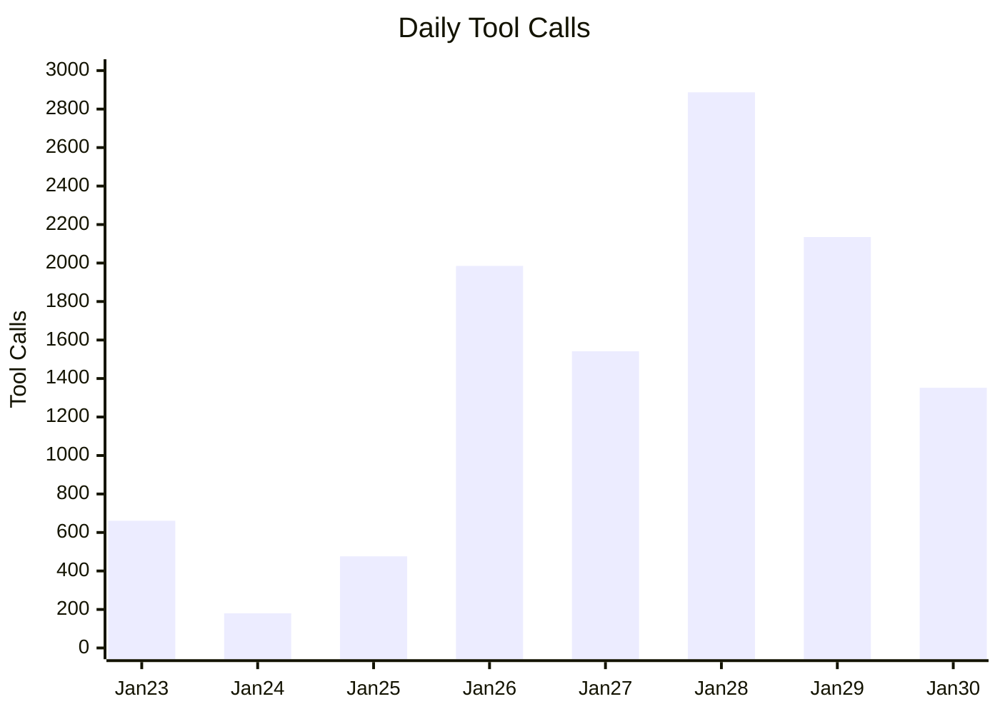
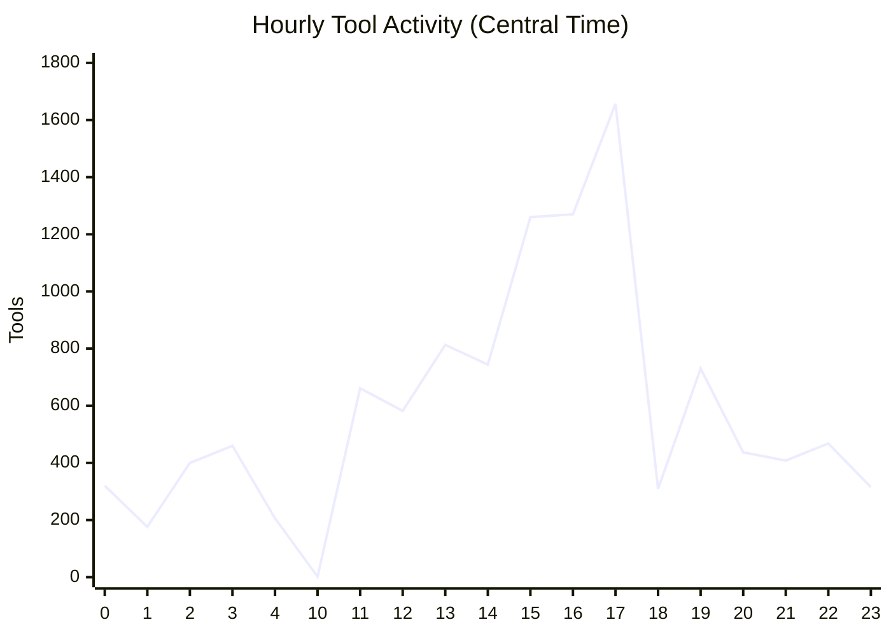
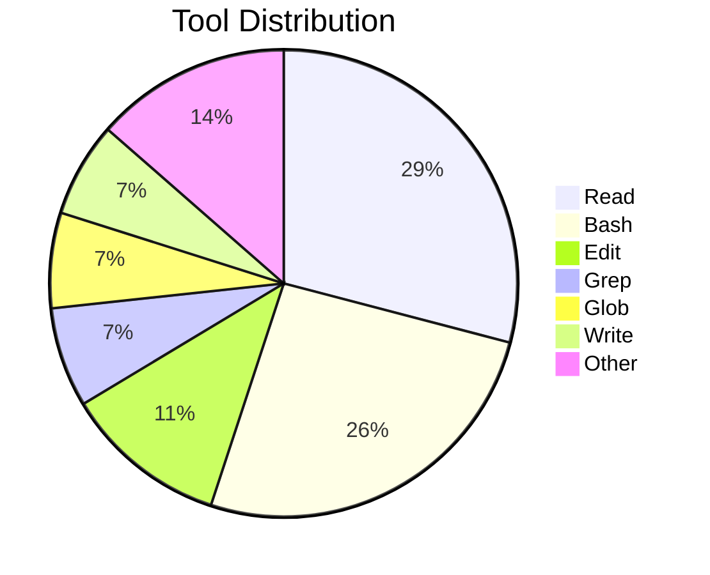
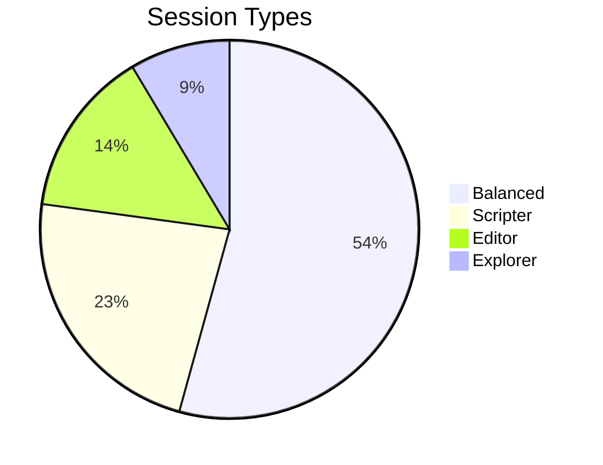

# Claude Code Productivity Report

**Period:** January 23-30, 2026 (7 Days)
**Generated:** January 30, 2026

---

## Executive Summary

| Metric | Value |
|--------|-------|
| Total Prompts | 1,058 |
| Total Tool Calls | 11,218 |
| Efficiency (Tools/Prompt) | 10.6 |
| Active Sessions | 40 |
| Projects Worked | 11 |

---

## Daily Productivity Trend

| Day | Prompts | Tools | Efficiency |
|-----|---------|-------|------------|
| Jan 23 | 25 | 661 | 26.4 |
| Jan 24 | 17 | 180 | 10.6 |
| Jan 25 | 45 | 476 | 10.6 |
| Jan 26 | 116 | 1,985 | 17.1 |
| Jan 27 | 91 | 1,542 | 16.9 |
| Jan 28 | 104 | 2,887 | **27.8** (Peak) |
| Jan 29 | 169 | 2,135 | 12.6 |
| Jan 30 | 491 | 1,352 | 2.8 |

---

## Hourly Activity Pattern (Central Time)

| Time Block | Prompts | Tools | Activity Level |
|------------|---------|-------|----------------|
| 12-4 AM | 88 | 1,562 | Night Owl |
| 5-10 AM | 3 | 2 | Sleep |
| 11 AM-1 PM | 555 | 2,056 | Morning Ramp |
| 2-5 PM | 241 | 4,931 | **Peak Hours** |
| 6-9 PM | 136 | 1,884 | Evening Wind-down |
| 10-11 PM | 35 | 783 | Late Night |

---

## Top 10 Tools

| Rank | Tool | Calls | Avg Duration |
|------|------|-------|--------------|
| 1 | Read | 3,262 | 10.7s |
| 2 | Bash | 2,913 | 10.3s |
| 3 | Edit | 1,271 | 4.3s |
| 4 | Grep | 776 | 8.8s |
| 5 | Glob | 741 | 11.5s |
| 6 | Write | 735 | 5.3s |
| 7 | TaskUpdate | 207 | 1.8s |
| 8 | Task (Agents) | 162 | **10.5 min** |
| 9 | ToolSearch | 113 | 0.9s |
| 10 | TaskCreate | 101 | 1.8s |

---

## Project Activity

| Project | Prompts | Tools |
|---------|---------|-------|
| BL-ETL.NET | 684 | 4,997 |
| Desktop/Threads | 91 | 1,691 |
| BL-ETL.NET/MetaSystem | 43 | 1,176 |
| Desktop/Stuff | 41 | 973 |
| BLETL Archimate | 41 | 505 |
| SystemAnimation | 34 | 517 |
| viv | 17 | 329 |
| RoslynMcpServer | 30 | 137 |
| Claude (telemetry) | 6 | 80 |

---

## Session Archetypes

| Type | Sessions | Avg Tools | Description |
|------|----------|-----------|-------------|
| **Balanced** | 19 | 431 | Mix of read/edit/run |
| Scripter | 8 | 217 | Bash-heavy automation |
| Editor | 5 | 135 | Focused code changes |
| Explorer | 3 | 119 | Codebase investigation |

---

## Key Insights

1. **Peak Efficiency Day:** January 28 with 27.8 tools per prompt
2. **Power Hours:** 2-5 PM Central Time (4,931 tool calls)
3. **Work Style:** Predominantly "Balanced" sessions mixing exploration and editing
4. **Agent Usage:** Task tool averages 10.5 minutes - heavy delegation to subagents
5. **Primary Project:** BL-ETL.NET with 4,997 tool calls this week

---

## Recommendations

- **Leverage peak hours** (2-5 PM) for complex tasks requiring deep focus
- **Consider more agent delegation** - sessions using Task tool show higher efficiency
- **Morning ramp-up** detected - schedule creative work after 11 AM
- **Night owl activity** present - ensure adequate rest for sustained productivity

---

*Report generated from Claude Code Telemetry v2.0*
